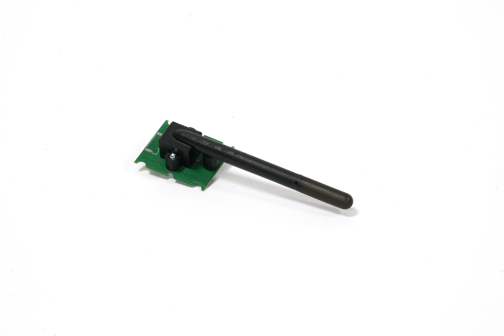
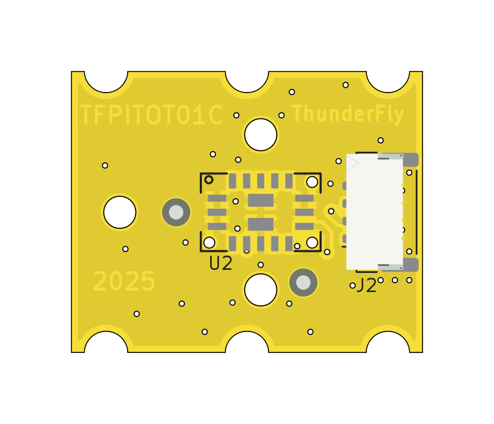
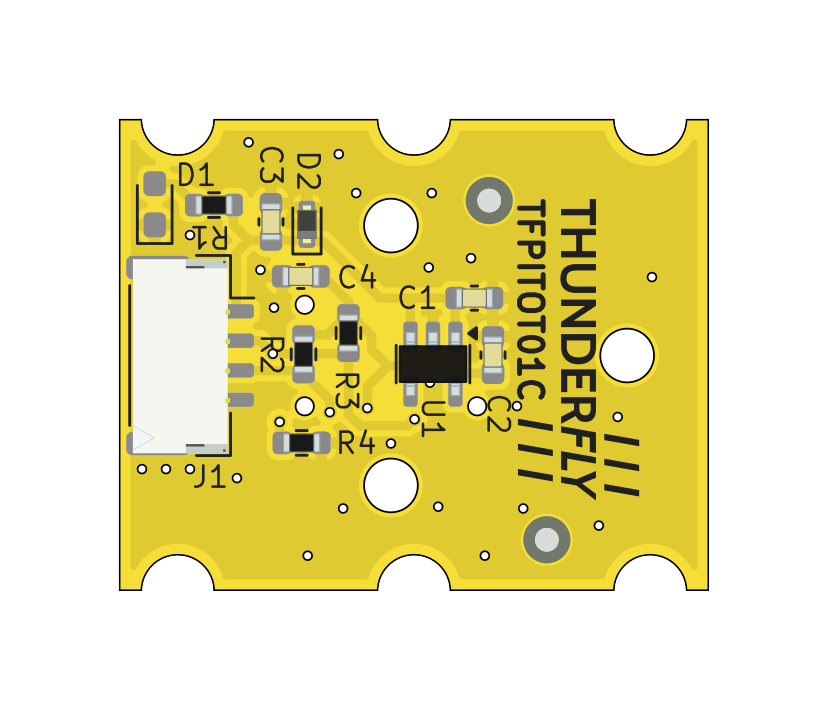

# TFPITOT01 - Lightweight Pitot Tube with Integrated Differential Pressure Sensor

The TFPITOT is an extremely lightweight pitot tube solution that integrates the SDP33 sensor, offering a compact and reliable airspeed measurement system. This product is designed to eliminate common issues found in traditional low-cost pitot tube design, such as temperature drift, offset, and the inconvenience of managing or failure of tubing.

## Key Features

- **Compact Tubeless Design**: The integrated sensor eliminates the need for external tubing and support components, saving weight and improving reliability.
- **No Temperature Drift or Offset**: The SDP33 sensor is highly accurate and does not suffer from temperature-induced drift or offset, ensuring reliable readings.
- **High Moisture Tolerance**: The robust design with high condensed water retention capacity ensures high reliability, making it ideal for applications with high humidity and moisture.
- **PX4 and Ardupilot Compatible**: The sensor is fully compatible with the PX4 and Ardupilot flight control software, allowing for easy integration into existing systems.

## Construction

The weight of PCB and screws, including sealing o-rings, is 1.7 grams. 

 

The TFPITOT01 is designed to be both lightweight and resistant to environmental factors. Despite its minimalistic construction, the pitot tube is rainproof. Any water that may enter the tube is either drained through its internal design or evaporates over time, ensuring continuous and reliable operation even in wet conditions.

### Technical Specifications

- **Sensor Type**: SDP33
- **Measurement Range**: ±1500 Pa (1 m/s to 50 m/s)
- **Accuracy**: 3% m.v., corresponds to ±1.5 m/s @ 50 m/s
- **Zero point accuracy**: 0.2 Pa
- **Operating Temperature Range**: -40 °C to +85 °C
- **Dimensions**: Tube length 45mm, diameter 6mm 
- **Weight**: 3 grams
  - L 80, D 5.1 mm, m 4.1 g
  - Electronics only 1.8 g
- **Default I2C Address**: 0x21 (configurable to 0x22 or 0x23 if needed)

## Applications

The TFPITOT01 is specifically designed for use in Unmanned Aerial Vehicles (UAVs), commonly referred to as drones, providing precise airspeed measurements for atmospheric monitoring.

## Installation Instructions

### Mounting the Pitot Tube

The TFPITOT01 must be correctly mounted to ensure reliable airspeed measurements. The tube must be aligned parallel to the airflow to guarantee accurate readings. It can be installed using one of the following methods:

- **Clamp Mounting**: The pitot tube can be inserted into a dedicated mounting bracket or clamp, which should be tightly fastened to prevent movement during operation.
- **Adhesive Bonding**: Alternatively, the tube can be bonded into a pre-fabricated socket or flange integrated into the aircraft’s fuselage or wing structure. Ensure that the adhesive used provides a durable and weatherproof seal.

To protect the internal electronics and the I2C connection cable from environmental exposure, the mounting solution must ensure a watertight seal. Only the front section of the pitot tube, which contains the pressure intake holes, should remain exposed to the external airflow. This prevents moisture ingress to electronics and ensures long-term durability in varying weather conditions.

### Connection to PX4 and Ardupilot

- Connect the TFPITOT01 to the unused I2C port on your flight controller.
- Configure the firmware parameters to recognize and utilize the SDP3x sensor driver for airspeed measurements.

### Calibration

Follow the calibration procedure outlined in the flight-stack documentation to ensure accurate readings.

## Availability and Customization

The TFPITOT01 is available from [ThunderFly s.r.o.](https://www.thunderfly.cz/). For a commercial quotation, contact us by email at sale@thunderfly.cz or shop at [Lectronz](https://lectronz.com/products/1062) or [Tindie store](https://www.tindie.com/stores/thunderfly/).

We also offer assistance with the design of a suitable mounting bracket or modifications to the tube geometry upon request. Basic dimensional changes, such as length or diameter adjustments, are provided at no additional cost with an estimated lead time of approximately three weeks.

